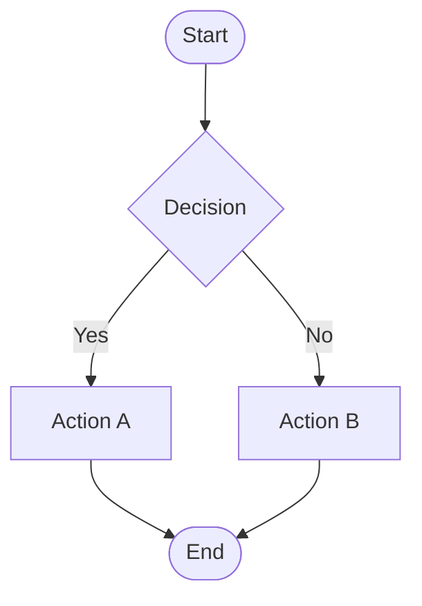
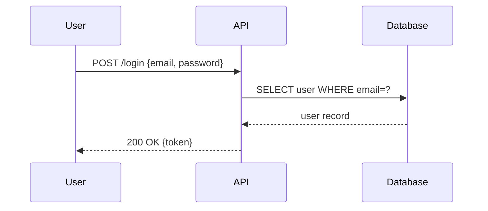
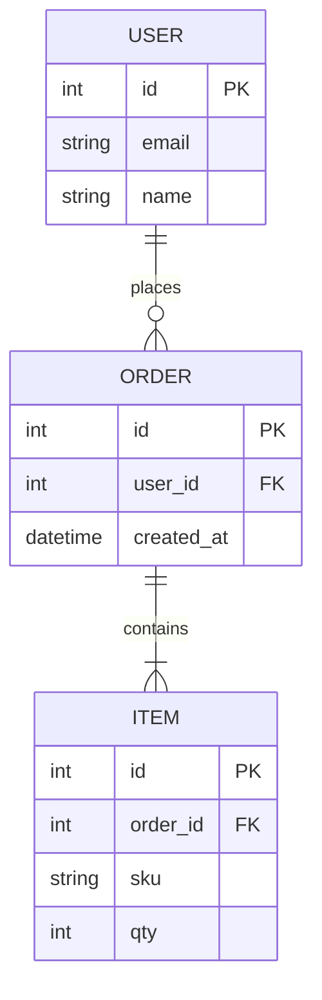
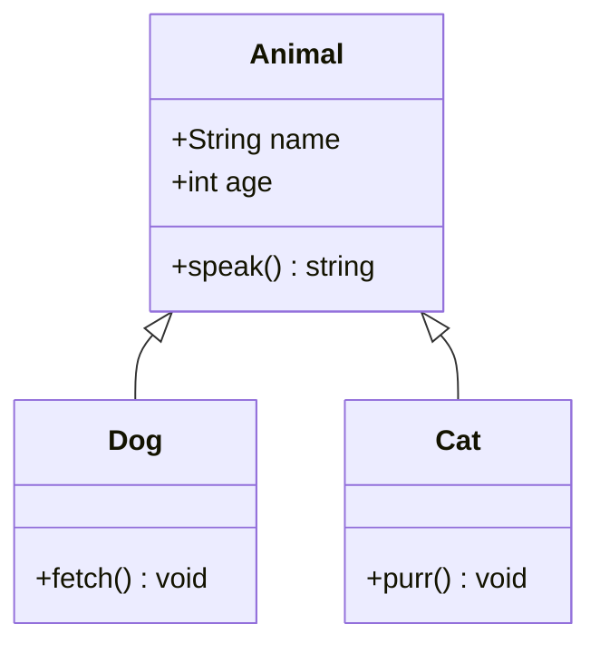
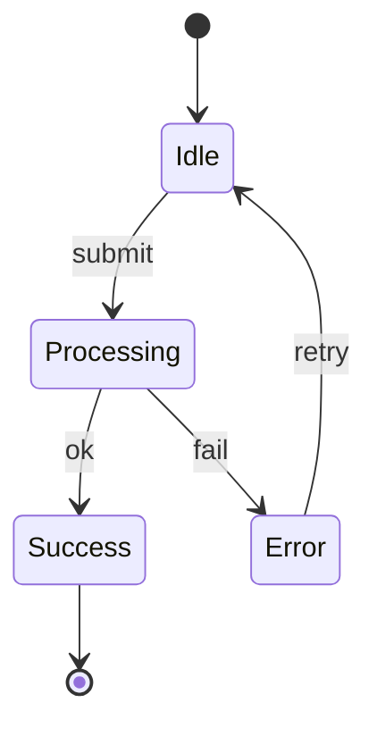
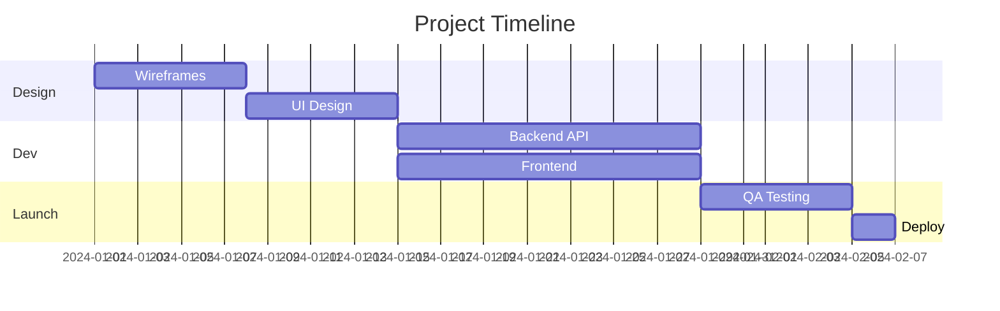
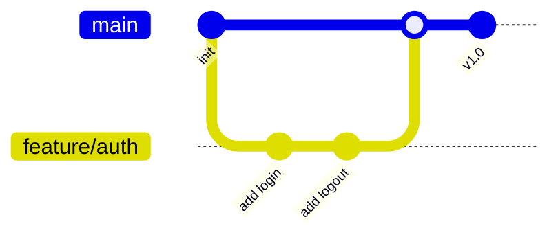
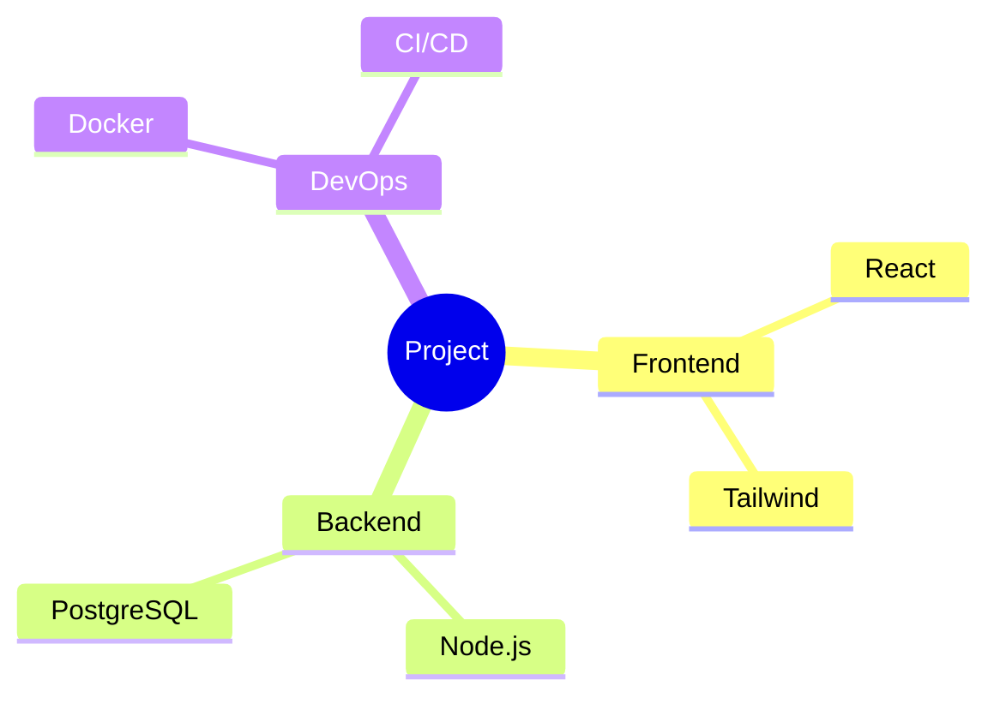

# Mermaid Diagram Examples

## Flowchart



## Sequence Diagram



## Entity-Relationship



## Class Diagram



## State Diagram



## Gantt Chart



## Git Graph



## Mindmap



## C4 Context

```mermaid
C4Context
    title System Context — Payment Service
    Person(user, "Customer", "Makes purchases")
    System(app, "Web App", "Frontend")
    System(pay, "Payment Service", "Handles payments")
    SystemExt(stripe, "Stripe", "Payment processor")
    Rel(user, app, "Uses")
    Rel(app, pay, "API calls")
    Rel(pay, stripe, "Charges card")
```
